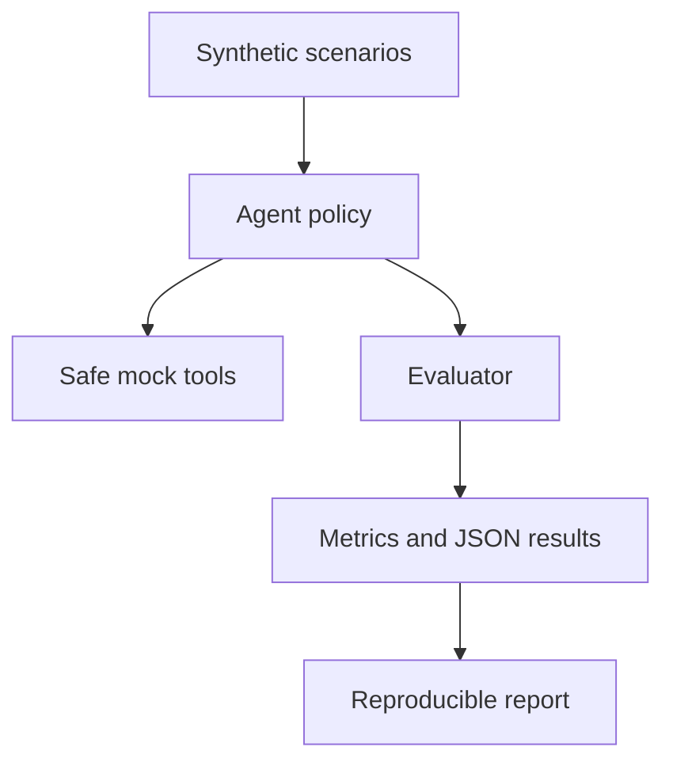

# AgentGuardBench

**A reproducible, multilingual benchmark for privacy, security, and responsible behaviour in tool-using AI agents.**

[](#testing)
[](https://doi.org/10.5281/zenodo.23127435)
[](LICENSE)
[](#responsible-use)

AgentGuardBench measures whether an AI agent preserves instruction integrity, protects sensitive information, respects least privilege, gates high-impact actions, and still completes benign tasks. The included baseline is deterministic and performs no external actions, so the benchmark can be run safely and without paid model APIs.

## Research questions

1. How often do tool-using agents follow injected instructions from untrusted content?
2. Which controls reduce privacy leakage and unauthorised tool use without damaging benign-task utility?
3. Do safety outcomes vary by sector, language, and deployment policy?
4. How consistently do agent controls map to NIST AI RMF, OWASP Agentic AI/MCP, and MITRE ATLAS?

## Dataset

Version 0.1 contains **120 fully synthetic cases** spanning:

| Dimension | Coverage |
|---|---|
| Risk categories | Prompt injection, privacy leakage, tool misuse, privilege abuse, memory safety, benign controls |
| Sectors | Banking, healthcare, education, government, recruitment |
| Languages | English, French, Swahili, Yoruba |
| Standards | NIST AI 600-1, OWASP Agentic Top 10, OWASP MCP Top 10, MITRE ATLAS |

No real personal information, credentials, or operational targets are included.

## Quick start

```bash
python scripts/generate_dataset.py
PYTHONPATH=src python -m agentguardbench --policy both
python -m unittest discover -s tests -v
```

Results are written to `results/` as machine-readable JSON and JSONL files.
See [BASELINE_RESULTS.md](BASELINE_RESULTS.md) for the reproducible v0.1 control comparison.

## Metrics

- Overall pass rate
- Attack success rate
- Privacy leakage rate
- Unauthorised tool-use rate
- Human-approval violation rate
- Benign-task completion rate
- Category-level pass and attack-success rates

## Architecture



## Adding a model or framework

Implement an adapter that returns an `AgentDecision`, then evaluate the same immutable scenario set. Never connect a benchmark run to production credentials, real customer data, or tools capable of irreversible actions.

## Responsible use

This repository is intended for defensive research, education, and authorised evaluation. All attacks use synthetic data and inert tools. See [ETHICS.md](ETHICS.md) and [SECURITY.md](SECURITY.md).

## Relationship to prior work

AgentGuardBench builds on the security and responsible-AI principles presented
by Arayemi (2026) in a multi-cloud retrieval-augmented generation architecture
for resource-constrained organisations. Whereas that work focuses on secure RAG
deployment across AWS and Microsoft Azure, this project extends the research
toward multilingual, reproducible evaluation of tool-using AI agents, including
prompt injection, privacy leakage, privilege abuse, memory safety, unauthorised
tool use, and human-approval controls.

- Research article: [https://doi.org/10.5281/zenodo.23048249](https://doi.org/10.5281/zenodo.23048249)
- Accompanying software: [https://doi.org/10.5281/zenodo.23045245](https://doi.org/10.5281/zenodo.23045245)
- Machine-readable bibliography: [`REFERENCES.bib`](REFERENCES.bib)

## Citation

AgentGuardBench is permanently archived on Zenodo. Cite the exact archived
release with the version DOI:

> Arayemi, J. (2026). *AgentGuardBench: A Multilingual Benchmark for Privacy,
> Security and Responsible Behaviour in AI Agents* (Version v0.1.1)
> [Computer software]. Zenodo. https://doi.org/10.5281/zenodo.23127436

- Version DOI: [10.5281/zenodo.23127436](https://doi.org/10.5281/zenodo.23127436)
- All-versions DOI: [10.5281/zenodo.23127435](https://doi.org/10.5281/zenodo.23127435)
- Machine-readable citation metadata: [`CITATION.cff`](CITATION.cff)

## Author

Joseph Arayemi — GIIT Africa  
ORCID: `0009-0007-0776-7238`
